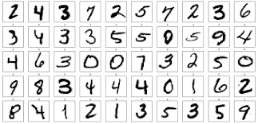

# MNIST_Handwritten_Digits_STARTER

# 1. Project Description
In this project, we will be given a Jupyter Notebook to do all of your coding and written explanations. we will preprocess a dataset for handwritten digit recognition, build a neural network, then train and tune that neural network using our data.

